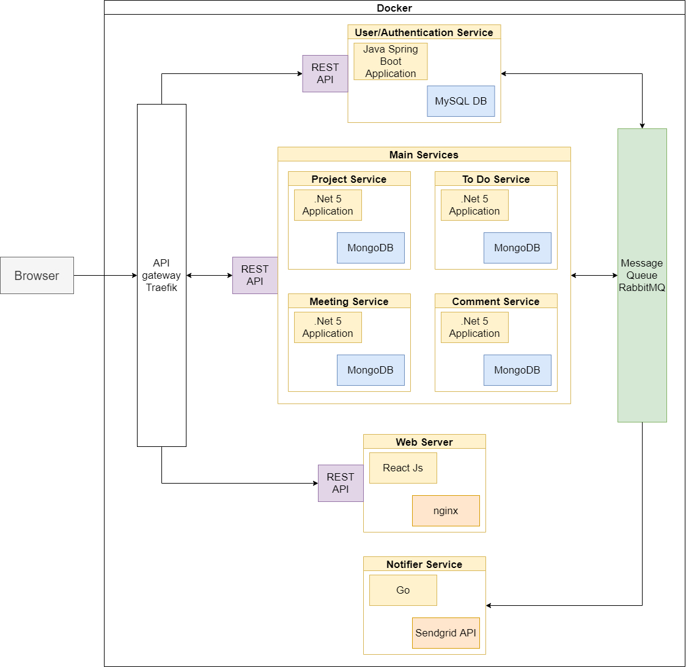
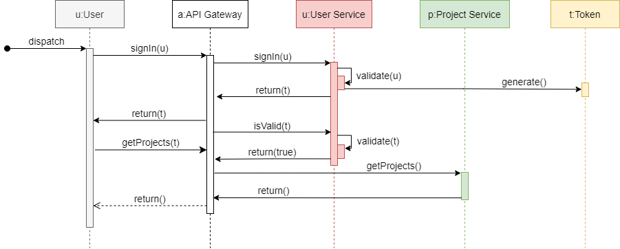
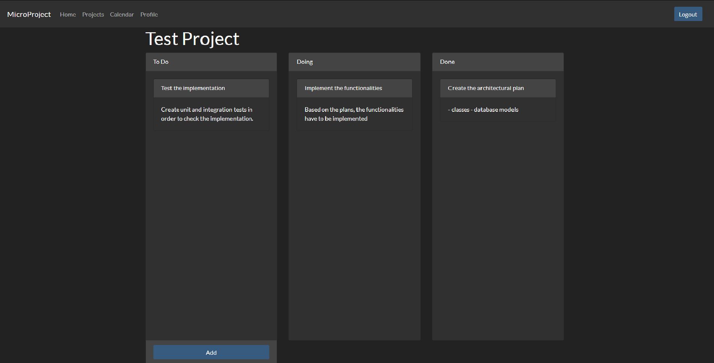
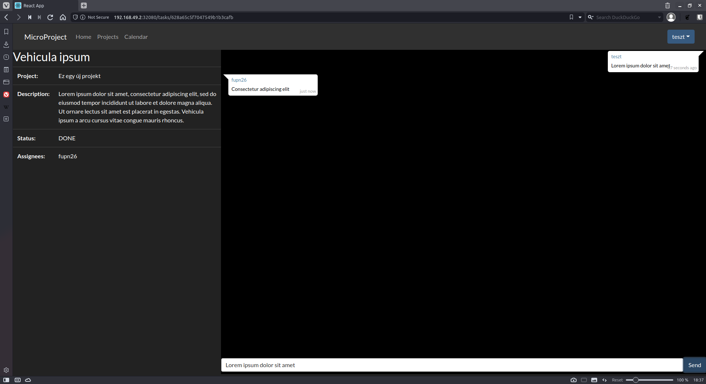
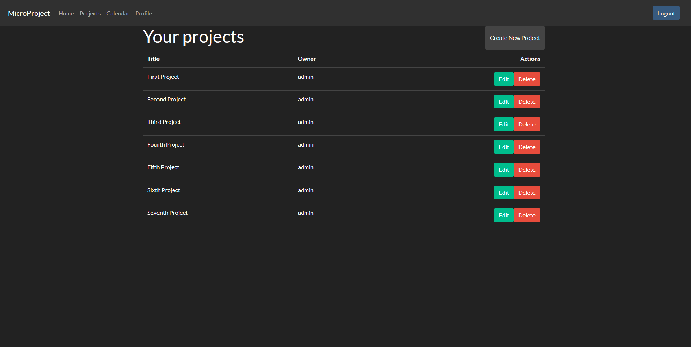
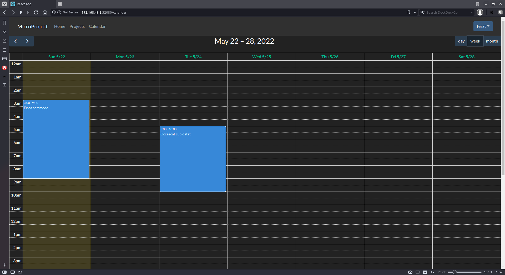
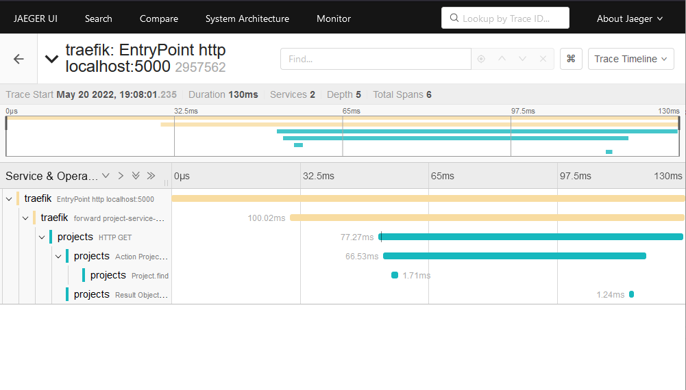

# MicroProject projektkezelő alkalmazás
**Fürjes-Benke Péter**

## Bevezetés
Manapság, az informatika előretörésével, egyre fontosabbá válik, hogy megbízható, stabil szoftverek készüljenek. Ezen belül is főleg a webes alkalmazások térnyerése jelentős. A felhasználók már az alkalmazásokra szolgáltatásként tekintenek, nem szeretnének foglalkozni azok telepítésével, hanem egyszerűen az interneten kerseztül, böngészőből szeretnék elérni a szükséges funkcionalitásokat. Ez abból is látszik, hogy a világon 2022-ben már körülbelül 5 milliárd aktív felhasználója van az internetenek. 

Az ilyen mértékű terhelés viszont komoly problémát okoz az internetes szolgáltatásokat futtató szerverek számára. Igaz manapság már közel korlátlan erőforrás áll rendelkezésre, köszönhetően a felhőszolgáltatóknak, de ennek költségét még a legnagyobb vállalatoknak sem nyereséges megfizetni. A céljuk, hogy szolgáltatásuk folyamatosan rendelkezésre álljon a felhasználóik számára, komolyabb kimaradások nélkül a lehető legolcsóbban.

Ez az elvárás vezetett el odáig, hogy a klasszikus, monolitikus alkalmazások háttérbe szorultak, ugyanis nehezen skálázhatók az aktuális igényekhez, továbbá fejlesztésük is problémás lehet több csapat esetén. Emiatt kezdett el terjedni az a megközelítés, hogy az alkalmazásokat kisebb, önálló részekre bontják fel, mikroszolgáltatásokra. Minden egyes rész egy jól körülhatárolt feladatot lát el, és működése csekély mértékben függ a többi szolgáltatástól. Ha az egyik szolgáltatás leáll, attól még a többi továbbra is elérhető marad a felhasználók számára. Továbbá, ha valamelyik szolgáltatáson nagyobb a terhelés, abból könnyen felindítható több példány is.  

Célom az általam elkezdett projektkezelő alkalmazás továbbfejlesztése volt, melynek funkcionalitása mikroszolgáltatásokból épül fel. Az egyes szolgáltatások Docker konténerben futtathatók, és a funkcionalitásuk csak egy API gateway-en keresztül érhető el a külvilág számára. Mikroszolgáltatás architektúráról lévén szó, az egyes szolgáltatásoknak egymástól függetlenül működőképesnek kell maradniuk. Ennek értelmében a rendszernek ellen kell állnia a tranziens hibáknak.

### Alkalmazás funkcionalitás részletes leírása
A programnak képesnek kell lennie projektek kezelésére, azon belül a feladatok állapotának nyomonkövetésére. A közös munka megkönnyítése érdekében a felhasználók az egyes feladatok alatt kommenteket írhatnak a haladásukról, vagy éppen javaslatokat tehetnek. Ezen felül a program lehetőséget ad találkozók létrehozására, mely bekerül a résztvevők naptárjába. A találkozókon elhangzott fontos információkról összefoglalókat lehet írni, mely a későbbiekben is visszanézhető. Emellett minden az adott projektben résztvevő értesítést kap a projektet érintő változásokról, módosításokról a regisztrációkor megadott e-mail címükre.

### Architektúra terv
<p align="center">

</p>

Az architektúra tervezése során a ```Domain Driven Design```-t követtem annak érdekében, hogy meghatározzam a szükséges mikroszolgáltatások körét. Ennek megfelelően összesen 5 alapvető szolgáltatásra bontottam fel az alkalmazást, melyek a ```polyglot``` elvet követve különböző programozási nyelven íródnak. A szolgáltatások elérésének biztosításáért a *Traefik API Gateway* felelős. Továbbá ezen keresztül érhető el az alkalmazás felhasználói felülete is. A szolgáltatások közötti üzenetsor alapú aszinkron kommunikációért pedig egy *RabbitMQ* példány felel.

### Authentikációs szolgáltatás
A felhasználók authentikációja és authorizációja a Keycloak alkalmazás felel, mely MySql adatbázisban tárolja az adatokat. Ez a szolgáltatás biztosítja a felhasználók regisztrációját, továbbá a rendszergazdák számára a felhasználói jogosultságok állítását.

### Felhasználói szolgáltatás
Egy *Spring Boot* keretrendszerben készített szolgáltatás, melynek feladata a felhasználókról információk lekérése az authentikációs szolgáltatástól. A funkcionalitását REST API-n keresztül publikálja.

### Projekteket kezelő szolgáltatás
A komponens egy *.Net* alapú alkalmazás, mely REST API-n keresztül biztosítja a projektek létrehozását, és azok kezelését. Az adatok struktúrájához igazodva ebben az esetben már egy dokumentum alapú *MongoDB* adatbázisban kerülnek eltárolásra a szükséges információk. Az adatbázis elérése ebben az esetben is a ```Repository``` mintának megfelelően egy burkoló osztállyal történik.

### Feladatokat kezelő szolgáltatás
A projekteken belül feladatokat lehet létrehozni. Ezek létrehozásáért és kezelésért felel ez a szolgáltatás. A funkciókat REST API-n keresztül biztosítja, a projektkezelő alkalmazáshoz hasonlóan. Ez esetben is a ```Repository``` mintát követi a komponens architektúrája, mely egy *.Net 5* alkalmazásban lett implementálva és maguk az adatok pedig egy *MongoDB* adatbázisban tárolódnak. Emellett egy *Redis* alapú cachet is tartalmaz a kérések gyorsabb kiszolgálása érdekében.

### Megbeszéléseket kezelő szolgáltatás
Ennek a komponensnek a feladat az egyes projektekhez tartozó megbeszélések létrehozásáért, és azok kezeléséért felelős funkciók biztosítása. A **projekt** szoláltatáshoz hasonlóan ez is egy *.Net* alkalmazás és az adatok *MongoDB*-ben tárolódnak.

### Hozzászólásokat kezelő szolgáltatás
A feladat leírásának megfelelően a felhasználóknak lehetősége van kommenteket írni az egyes feladatokhoz. Az ehhez szükséges funkciók biztosítása a feladata ennek a szolgáltatásnak. Ez a szolgáltatás is egy *.Net 5* alkalmazás, mely *MongoDB*-ben tárolja a hozzászólásokat.

### Értesítő szolgáltatás
Ez a *Go* nyelven írt szolgáltatás felel azért, hogy értesítse a felhasználókat abban az esetben, ha valamelyik projektjükben változás történt. Mivel ehhez mindegyik korábbi szolgáltatással kapcsolatban kell lennie, ezért egy üzenetsor alapú kommunikációt valósít meg a *RabbitMQ* segítségével. A megkapott üzeneteket pedig továbbítja e-mail-ben a felhasználóknak a *SendGrid API* segítségével.

### Webszerver
A webszerver feladata, hogy elérhetővé tegye a React keretrendszerben megírt weboldalt, mely - felhasználva a korábbi szolgáltatásokat - biztosítja a teljes rendszer funkcionalitását. Ez a szolgáltatás egy *NGINX* webszervert használ.

## API gateway
A MicroProject alkalmazás több szolgáltatásból épül fel, és ezek mindegyike egy meghatározott REST interfészen keresztül publikálja a szolgáltatásait. Annak érdekében, hogy egy címen keresztül el lehessen érni az összes szolgáltatást egy API gatewayt használtam, azon belül is a *Traefik* megoldását, mely egyszerűen konfigurálható a  *Docker Compose* konfigurációs fájljával együtt. A ```docker-compose.yml``` fájlban elég csak megadni a route-olási szabályokat az egyes szolgáltatásokhoz, amik alapján a *Traefik* pedig konfigurálja az elérési utakat. Ezek után már a frontend fejlesztésénél elég volt a *Traefik* által publikált címet, mint alap URL-t használni, és a kérések a megfelelő mikroszolgáltatáshoz irányítódnak.

Az egységes interfészen kívül még előnye az API Gateway használatának, hogy biztonságos *HTTPS* kapcsolatot elég csak kifelé biztosítani, a mögötte lévő szolgáltatások egyszerű *HTTP* protokollon kommunikálhatnak egymással. Továbbá a Traefik egyéb szolgáltatásokat is nyújt, mint például a ```Forward Authentication```, amelyről a következő fejezetben lesz szó.

## Felhasználó authentikáció
### Korábbi megoldás
<p align=center>

</p>

Kezdetben a **Felhasználói szolgáltatás** feladatai közé tartozott, hogy biztosítsa a felhasználók authentikációját. Amikor a felhasználó sikeresen bejelentkezett, akkor kapott egy ```JWT```(Json Web Token)-t.
Ezzel pedig engedélyt kapott arra, hogy elérje a többi szolgáltatást. Az **API Gateway** minden védett erőforrás elérése előtt intézett egy lekérdezést a **Felhasználói szolgáltatás** felé, hogy az adott JWT token érvényes-e még. Ezt a *Traefik* által biztosított ```Forward Authentication``` teszi lehetővé, mely a ```Federated Identity``` mintát követi.

### Oauth
```
IDE JÖN MAJD KÉP AZ OAUTHról
```
Ha védelemről van szó, akkor általánosságban azt szokás mondani, hogy érdemes a már jól bevált, megbízható megoldásokat előnyben részesíteni a saját megoldással szemben. Pontosan ezért döntöttem úgy, hogy inkább az OAuth ```Authrozation Code Flow``` megoldását választom a felhasználók authentikációjára és authorizációjára. Az OAuth több metódust is kínál a token megszerzésére. Egy lehetséges alternatíva lett volna az ```Implicit Flow``` használata, de mivel előbbi opció duplán validálja, hogy megbízható kliens kap-e engedélyt, így arra esett a választásom.  Authorizációs szervernek a nyílt forráskódú *Keycloak* rendszert választottam, mely Docker konténerből onpremise futattható. Ez a szoftver teszti lehetővé a felhasználók bejelentkezését, kijelenetkezését és regisztrációját.

Az authorizáció ebben az esetben úgy működik, hogy a felhasználó a *Keycloak* bejelenetkeztető oldalára irányítódik át, megadja az adatait vagy ha még nincs fiókja, akkor regisztrál, majd kap egy authorizációs ```code```-ot. Azt egyszer felhasználhatja ```access```, ```refresh``` és ```id``` token lekérésére. A programom ezek közül csak az ```access``` tokent használja fel, mely ez esetben is ```JWT``` formátumú, tehát a rendszer kompatibilis maradt a korábbi megoldáshoz elkészített infrastruktúrával. Az ```access``` token segítségével pedig hozzáférést nyer a védett erőforrásokhoz. Mivel minden genenerált token rendelkezik egy aláírással, amihez a titkot csak a *Keycloak* szolgáltatás ismeri, így biztosított, hogy a támadók kellően nehezen tudnak olyan tokent generálni, amit a szolgáltatás érvényesnek ítélne. Az **API Gateway** feladata, hogy ellenőriztesse az ```access``` token hitelességét a *Keycloak* szolgáltatással minden védett erőforráshoz intézett kérés esetén. Ha a token nem megfelelő, előfordulhat, hogy nem kell a *Keycloak*-ba újra bejelentkezni. Ebben az esetben csak az ```access``` token érvényessége járt le, nem a felhasználó munkamenete. Ellenkező esetben be kell jelentkeznie. A kijelentkezéshez szintén a *Keycloak* által biztosított kijelentkeztető oldalra irányítódik át a kliens.

## Szolgáltatások közti kommunikáció
Megvizsgálva a kapcsolatot a projekteket kezelő szolgáltatások között, látható, hogy bizonyos szintű kommunikációra szükség lenne közöttük a konzinsztencia megőrzése érdekében. Fontos tisztázni, hogy a mikroszolgáltatás architektúránál, mivel bármelyik szolgáltatás kieshet, ezért csak esetleges konzisztencia valósítható meg. Éppen ezért szükséges olyan könyvtárak használata, melyek képesek kezelni az egyes szolgáltatások kiesését. Ilyen a *.NET*-es alkalmazásokhoz a *Polly* programkönyvtár, melyet én is használok a szoftveremben. Segítségével több policy-t egymásba lehet láncolni, mint a ```Circuit Breaker```, a ```Retry``` és a ```Fallback```. A ```Retry``` biztosítja, hogy többször újra tudjuk indítani a kérést, míg a ```Circuit Breaker``` lehetővé teszi azt, hogy ne terheljük túl a szükséges szolgáltatást. Ha pedig végképp nem tudjuk elérni a leállt mikroszolgáltatást, ezt le tudjuk kezelni a ```Fallback``` policy-vel. Ezt a 3 policy-t alkalmaztam én is a **projekteket** kezelő szolgáltatásban.

### Fejlesztés alatt
A *Polly* programkönyvtár segítségével sikerült elérnem, hogy a szinkron kommunikációt igénylő szolgáltatások közti kommunikáció megoldódjon, továbbá, hogy ellenálljon az egyes szolgáltatások kiesésének. Viszont olyan események, mint egy projekt törlése nem igényel szinkron kommunikációt, elég csak aszinkron módon értesíteni jelenesetben a **megbeszéléseket** és a **feladatokat** kezelő mikroszolgáltatást. Ehhez pedig ideális a *RabbitMQ* használata, mely lehetővé teszi az üzenetsor alapú kommunikációt.

## Értesítő szolgáltatás
Ahogy az architektúra tervnél már említettem ez egy *Go* nyelven írt program, mely 2 funkcióval rendelkezik. Az egyik, hogy fogadja az üzeneteket a többi projektkezelő szolgáltatástól, a másik, hogy ezeket az üzeneteket továbbítja e-mailben a felhasználók felé. Ennek következtében ez a szolgáltatás nem biztosít REST-es végpontot. Az üzenetek fogadása aszinkron módon, vagyis a többi szolgáltatás nem várja meg, míg kap visszacsatolást az e-mail küldés sikerességéről. Ezt a kommunikációt a *RabbitMQ* megoldásával valósítottam meg. Annak érdekében, hogy ne kelljen külön *SMTP* szervert használnom, a *SendGrid* e-mail küldő szolgáltatását vettem igénybe. Ehhez létre kellett hoznom egy küldő entitást, mely megjelenik a kiküldött e-mailekben. Továbbá a szolgáltatás használatához szükségem volt egy API kulcsra, melyet az **értesítő** szolgáltatás környezeti változóként kap meg. Jelenleg új projekt létrehozásakor kap értesítést a létrehozó, hogy létrejött a projekt.

A szolgáltatás elkészítésénél az egyik legnagyobb probléma az volt, hogy a *GO* nyelvhez készített *RabbitMQ* kliens könyvtár nem támogatja az újra csatalakozást, vagyis a szolgáltatásokból kieséséből eredő problémák kezelésést. Ennek megoldásához találtam a [go-rabbitmq](https://github.com/wagslane/go-rabbitmq) programkönyvtárat, ami az alap *RabbitMQ* klienst egészíti ki a szükséges funkciókkal. A végső megoldásban ezt használtam.

## Cache használata
Annak érdekében, hogy az egyes kéréseket a szolgáltatások gyorsabban ki tudják szolgálni, érdemes a gyakran lekérdezett adatokat cache-elni. 
A **feladatokat** kezelő szolgáltatást egészítettem ki ilyen funcionalitással, melyhez a *Redis* ```in-memory``` adatbázisát használtam. Ez egy kulcs-érték alapú *NoSql* adatbázis. Az egyes feladatokat az ID-ját használtam, mint kulcs, értékként pedig magát a feladat objektumot adtam meg.

Minden ```GET``` kérés esetén elsőnek megvizsgálja a program, hogy a cache-ben már elérhető-e a szükséges feladat. Ha nem, akkor lekérdezi az *MongoDb* adatbázistól, ezután pedig frissíti a cache-t. Ha valamelyik feladat módosul, vagy törlődik, akkor a hozzá tartozó elemet a cache-ből törli a program. Amikor létrejön egy új feladat, akkor az automatikusan bekerül cache-be. Tehát ebben a megoldásban az időbeli lokalitás elvét használtam ki, mely azt mondja, hogy ha egy feladathoz egyszer hozzányúltunk, akkor többször is hozzá fogunk nyúlni.

## React Frontend
A mikroszolgáltatások összefogása érdekében készítettem egy webes felhasználói felületet, melynek feladata, hogy egy egységes felületet biztosítson a projektek kezeléséhez. A felhasználói felületet ```Single Page Application```-ként készítettem el a *React* keretrendszer segítségével. Ennek megfelelően az egyes funkcionalitásokhoz tartozó felületet komponensként hoztam létre, és nem egy teljesen új oldalként.

### Felhasználói felület
A UI tervezése során arra törekedtem, hogy egy letisztult, modern felültet biztosítson a rendszer, melynek használata kényelmes a felhasználók számára. Ennek érdekében merítettem ötleteket több már piacon lévő projektmenedzser alkalmazásból, mint például a *Trello* vagy a *Jira*. Így amellett döntöttem, hogy a projekteken belüli feladatok állapotának vizualizálásához egy kanban táblát fogok használni.

<p align="center">

</p>

A tábla elkészítése mellett korábban megoldottam, hogy az egyes elemeket *Drag&Drop* módon át lehessen rakni egyik oszlopból a másikba. Annyi megkötés van jelenleg a táblára vonatkozóan, hogy nem lehet más oszlopokat felvenni, hanem a feladatokat fixen 3 csoportba lehet sorolni. Vagyis vannak az elvégzendő, a folyamatban lévő és a befejezett feladatok. A feladatokat lehetősége van a felhasználóknak törölni is. A *Details* gomb megnyomásával pedig elérhető a felület, melyen keresztül lehetőség van a már létező feladatok részleteinek megtekintésére. 

<p align="center">

</p>

A feladat részletei mellett, a projekt résztvevőinek lehetősége van megbeszélni az adott feladattal kapcsolatos kérdéseket. Ezt teszi lehetővé a klasszikus üzenetkezelő alkalmazásokban megszokott felület. Vagyis egyik oldalon láthatóak a saját üzeneteink, a másik oldalon pedig a többi felhasználó kommentjei. Továbbá azt is látható, hogy ki küldte az üzenetet, és mikor.

A felhasználóknak természetesen lehetőségük van böngészni a projektjeik között, ehhez nyújt segítséget a korábban elkészített projekteket listázó komponens.

<p align="center">

</p>

Ezen a felületen van lehetősége a projektgazdáknak szerkeszteni az egyes projekteket. Módosíthatják a projektek nevét, és hozzárendelt felhasználók listáját. Továbbá törölhetik is a projekteket, ha arra már nincs szükség. Természetesen ez csak a projektgazdákra igaz, a többi felhasználónak ehhez nincs jogosultsága.

<p align="center">

</p>

Mindezek mellett a találkozók beütemezését is lehetővé teszi a weboldal. Ehhez egy naptárnézetet biztosítottam a felhasználók számára. Ezen belül létrehozhatnak új eseményeket, böngészhetnek az események között és természetes szerkesztehetik is őket. Szerkesztésre kiváló ok például, hogy utólag az esemény résztvevői kiegészíthetik az eseményeket a megbeszélésen elhangzott hasznos információkkal. Maga a naptár támogat nap, hét és hónap szintű lebontást. A esemény időtartamának kijelölése lehetésges mezők kijelölésével, vagy a felugró ablakban is lehetséges a pontos idő beállítása.

### Authentikáció
Korábbi fejezetben ismertetett authentikációs folyamatot meg kellett valósítanom a frontenden is. Ezt úgy oldattam meg, hogy a felhasználói felületen csak a **welcome** komponens érhető el bejelentkezés nélkül. Ha a felhasználó valamelyik másik komponensre szeretne váltani, akkor automatikusan át lesz irányítva a *Keycloak* bejelentkeztető felületére. Ha a bejelentkezés sikeres, akkor a **user action** komponens eltárolja a kapott ```access``` tokent sütiként. Ez azért jó megoldás, mert a így automatikusan törlődik, amikor lejár a token érvényessége. Emellett eltárolom a ```refresh``` tokent is, annak érdekében, hogy átirányítás nélkül lehessen újra ```access``` tokent kérni a *Keycloak* szolgáltatástól. Egy másik megközelítés az is lehetne, hogy a *Local Storage*-ban tárolom a tokent, viszont ebben az esetben nekem kellene ellenőriznem, hogy mikor került be a token, és manuálisan kellene törölni. Azt, hogy a bejelentkezés megtörtént-e, a komponens betöltésekor vizsgálom meg úgy, hogy ellenőrzöm a token meglétét a sütik között. A kijelentkeztetést a *Keycloak* alapesetben úgy oldja meg, hogy egy külön kijelentkeztető oldalon meg kell erősíteni, hogy tényleg kiszeretne-e jelentkezni a felhasználó. Viszont ezt átalakítottam úgy, hogy a felhasználó azonnal ki tud jelentkezni, nem kell megerősítés. 

Maga a token tárolás módjában sajnálatos módon van biztonsági kockázat. Ugyanis a token böngészőben történő tárolása lehetővé teszi ```XSS``` támadások indítását. Ez a ```Single Page Application```-ök esetében jellemző probléma. Egy lehetséges megoldás lenne, hogy a tokent egy külön munkameneteket kezelő szerveren tárolom el, és a kliens csak egy ```session``` tokent kap, amit ráadásul ```HttpOnly``` sütiként kapna meg, ezzel garantálva, hogy ne lehessen *JavaScript*-es kódból elérni. Ebben az esetben minden kérés esetén a ```session``` szerver fordított proxyként üzemelne, azon keresztül tudna csak hozzáférni a védett erőforráshoz a kliens.

### Azonalli üzenetkezelés
A felhasználói felületet bemutató részben már említettem, hogy a felhasználóknak lehetőségük van kommenteket írnia az egyes feladatokhoz. Ahhoz, hogy valósidejű kommunikáció áljon a rendlekezésükre a *SignalR* programkönyvtárat használtam. Ennek a nagy erőssége, hogy a *WebSocket* mellett támogatja a ```long polling```-ot is, ezek között dinamikusan ki tudja választani, hogy melyik áll éppen rendelkezésre az adott kliens viszonylatában. Ahhoz, hogy ez működjön a **kommenteket kezelő** szolgáltatást is módosítanom kellett. Úgy oldottam meg, hogy a kliensek nem közvetelenül kapják meg az új üzenetet, hanem a csak értesítést kapnak arról, hogy frissítsék a rendelkezésükre álló kommentek listáját. Tovább az üzenetek nem a *SignalR* Hubnak küldik, hanem a REST-es interfésznek, és az értesíti a Hub-ot, hogy értesítse a klienseket. Erre azért volt szükség, mert a *WebSocket* nem garantálja, hogy az üzenet megérkezik a csatlakozott kliensekhez vagy éppen a szerverhez. Továbbá így egységesebben lehetett implementálni a **kommenteket kezelő** szolgáltatással történő kommunikációt, hiszen elég csak REST-es kéréseket használni. 

### Fejlesztés alatt
Az webalkalmazás biztosítani fog egy profil oldalt is, ahol az aktuális névről, a megadott e-mail címről és egyéb adatokról lehet majd informálódni. Természetesen ezek módosítására is lesz lehetőség, kiemelt figyelemmel az e-mail címekre, hiszen ezen keresztül kaphatnak majd tájékoztatást a fontos projektbeli változásokról.

## Kubernetes
Éles környezetben több igény is felmerülhet, melynek megoldása nem könnyű *Docker Compose* használatával. Szükség lehet szolgáltatások replikációjára a terhelés elosztása érdekében, a hibás konténerek újraindítására, továbbá a felindított konténerek frissítésének és konfigurálásának kezelésére. Ezen igények kielégítése érdekében érdemes használni konténer *orchestratort*, mint például a *Kubernetes* vagy a *Docker Swarm*. Én a projektemhez az előbbit választottam, ugyanis az egyik legelterjedtebb megoldás.

Ahhoz, hogy a szoftver felinditható legyen *Kubernetes* klaszterben, el kellett készítenem több konfigurációs fájlt is a szolgáltatásaimhoz. Az első a *Deployment* konfiguirációs fájlok elkészítése volt. Ez lényegében adott szolgáltatás kívánt állapotát határozza meg, és ezen keresztül lehet frissíteni a szolgáltatásokat. A háttérben ```ReplicaSet```-et és azon belül ```Pod```-okat hoz létre. A ```ReplicaSet``` határozza meg, hogy az egyes szolgáltatásokból hány replika,```Pod``` induljon el, és ezt a számot folyamatosan igyakszik tartani. Ha az egyik pod leáll, akkor azonnal indít egy újat. A ```Pod``` áll a legközelebb a klasszikus *Docker* konténerekhez. De egy ```Pod```-ban több konténer is futtatható. A megoldásomban az egy szolgáltatás, egy ```Pod``` javasolt megközelítést követtem. Ahhoz, hogy a szolgáltatás elérhető legyen a klaszteren belül, szükség van egy ```Service``` definiálására is. Ebben határozzuk meg, hogy milyen hoszt néven, és milyen portokon érhető el az adott szolgáltatás. Végezetül pedig, azon szolgáltatások esetén, melyet ki kell engednem az *API Gatewayen* keresztül, egy ```Ingress```-t is meg kellett határozni. Ebben adtam meg, hogy mely URL útvonalakat írányitsa a *Traefik* az adott szolgáltatás adott portjához.

### Szolgáltatások konfigurálása
Az egyes komponensek tervezésekor külön figyelmet fordítottam arra, hogy a lehető legtöbb paraméter konfigurációs fájlból módosítható legyen. Például lehetőség van szolgáltatásoknál beállítani az adatbázis URL-t, az adatbázis használatához szükséges hitelesítő adatokat, vagy éppen az adatbázis nevét. Ezeket a paramétereket mind úgy terveztem, hogy ne csak egy konfigurációs fájlból lehessen őket beállítani, hanem környezeti változókkal is. Ezt a megoldást alkalmaztam a ```docker-compose.yml``` fájlban is, és ebből indultam ki a *Kubernetes* konfigurációs fájlok esetében is. Viszont bizonyos értékeket nem lehet a konfigurációs fájlban definiálni, mint a jelszavak vagy a *SendGrid*-hez szükséges API kulcs. Ezek megadásához a *Kubernetes* átal biztosított ```Secret```-eket használtam. Ezeket nem hoztam létre előre, hanem a rendszert telepítő feladata, hogy elkészítse a szükséges fájlokat. Minden szükséges ```Secret``` konfigurációs fájlhoz megadtam egy sablont, amit csak ki kell tölteni.

### Helm Chart
Annak érdekében, hogy az alkalmzást egyszerűbb legyen frissíteni a *Kubernetes* klaszterben, megoldottam, hogy *Helm* chart segítségével lehessen telepíteni. Ennek keretében főleg a *Docker* konténerek verzióját tettem paraméterezhetővé a **values.yml** fájlban, így ezeket az értékeket felül lehet írni a telepítés során, ha pedig nem írjuk felül, akkor az alapértelmezett, **values.yml** fájlban lévő értékek kerülnek behelyettesítésre. Így könnyen tesztelhetjük az egyes szolgáltatások újabb verzióit. Mindezek mellett nagy előnye a *Helm* chartokkal történő telepítésnek, hogy támogatja a verziókövetést. A *Helm* folyamatosan számontartja, hogy éppen hanyadik verzióját futtajuk az adott chartnak, vagyis bármikor vissza tudunk állni egy korábbi konfigurációra.

## Nyomkövetés
Elosztott rendszerek fejlesztése során gyakran felmerül olyan probléma, hogy egyes lekérdezések túl lassúak. Ilyenkor pedig meg kell vizsgálni, hogy melyik szolgáltatás okozza a váraklozást. Ebben segít az elosztott nyomkövetés. Lényege, hogy egy kérést végig tudjuk követni akár egészen az adatbázis lekérésekig, hogy meglássuk melyik komponens a szűk keresztmetszet a rendszerben. Mindezek mellett logokat is lehetőségünk van gyűjteni a nyomkövetés során, ezzel többet megtudva a kérés egyes részeiből.

Ennek megvalósításához én a Jaeger szoftvert választottam, mely összegyűjti az egyes szolgáltatásopk által küldött ```Span```-eket, melyek tartalmazzák az adott szolgáltatásban lefuttatott kérések idejét. A begyűjtött adatokat pedig egy weboldalon megjeleníti, így könnyen lehet elemezni a szoftver teljesítményét.

### Példa
<p align="center">

</p>

Például az ábrán látható, hogy a leghosszabb ideig az adatbázis művelet tartott. Ez egy kicsit nehezen látható, ugyanis nem szinkron kérésként történik az adatok lekérése, hanem aszinkron módon, ezért mutatja a *Jaeger* nagyon rövidnek a kérést, és sok idő után a válasz összeállítása is megtörténik pár milliszekundum alatt. Valójában a két művelet eltelt idő végig az adatbázis művelet volt.

### OpenTracing és OpenTelemetry probléma
A nyomkövetés megvalósítása során kezdetben az *OpenTelemetry* könyvtárt terveztem használni, ugyanis ez lényegében az utódja az *OpenTracingnek* és a *Jaeger* dokumentáció is ezt javasolja. Viszont a *Traefik* még nincs felkészítve az *OpenTelemtry* által használt kontextus propagációra. A kontextus propagáció azért fontos, hogy a *Jaeger* fel tudja ismerni, hogy mely ```Span```-ek tartoznak egyazon ```trace```-hez. Ehhez minden könyvtár egy speciális fejlécet használ, és a komponens, mely kezdi a követést, az adja tovább a többi komponensnek. A probléma az én esetemben az volt, hogy az *OpenTelemetry* a W3C által definiált fejlécformátumot használja, és ezt a *Traefik* még nem támogatja. Viszont az *OpenTracing* által használt propagációt támogatja, ezért végül ezért ezt használtam a **projekteket** kezelő szolgáltatásban, hogy vizsgálhassam nyomkövetés működését. Emellett a **felhasználókat** kezelő szolgáltatásban az *OpenTelemetry* kliensét használtam, hogy ha elkészül a támogatás a *Traefik*-hez, akkor már ne kelljen módosítani a szolgáltatáson.

## Összegzés
A MicroProject projektmenedzser alkalmazás továbbfejlesztése során a mikroszolgáltatás architektúrával kapcsolatos újabb technológiákkal ismerkedtem meg. 

Elsőnek befejeztem az **értesítő** szolgáltatást, mely *RabbitMq* segítségével üzenetsoron keresztül kap információt arról, hogy kinek és milyen információt kell küldenie. Az e-mailek továbbítására pedig a *SendGrid* API-ját használtam. Az azsinkron kommunikáció mellett a *Polly* könyvtár segítségével megoldottam, hogy szolgáltatások ellen tudjanak állni a tranziens hibáknak az egymás közti kommunikáció során.
Annak érdekében, hogy a kérések lefutásán gyosítsak cachelést vezettem be, egyelőre a **feladatokat** kezelő szolgáltatásnál. Ehhez pedig a *Redis* kulcs-érték alapú ```in-memory``` adatbázisát használtam. 

A **frontend** szolgáltatás funkcióinak kibővítésével is foglalkoztam. Megoldottam, hogy létre lehessen hozni eseményeket egy naptár felületen keresztül. Az eseményeket lehet módosítani, és ki lehet őket egészíteni hasznos információkkal. Emellett foglalkoztam a feladatokat kezelő felület bővítésével. Megoldottam, hogy törölni is lehessen feladatokat, továbba, hogy valós időben tudjanak kommunikálni egymással a feladatban résztvevők, köszönhetően a SignalR könyvtárnak.

A szolgáltatások indításához használható **docker-compose.dev.yml** fájl mellé készíttettem *Kubernetes* konfigurációs fájlokat annak érdekében, hogy *Kubernetes* klaszterben is lehessen tesztelni a szoftvert. A saját szolgáltatások telepítését pedig lehetővé tettem *Helm* chart segítségével is, mellyel könyebben lehet frissítéseket publikálni, továbbá korábbi verziókhoz visszatérni.

A rendszer nyomonkövethetősége érdekében a **projekteket** kezelő, a **felhasznókat** kezelő és az **API Gateway** szolgáltatásokat megoldottam az automatikus kód instrumentációt az *OpenTelemetry* és az *OpenTracing* könyvtárakkal. Így a *Jaeger* szoftver segítségével látható, hogy az egyes kérések milyen komponensekből állnak, továbbá, hogy mennyi ideig tartanak. Az **authentikációs** szolgáltatást is átalakítottam. A saját megoldásomat lecseréltem az *OAuth* ```Authorization Code Flow``` folyamatára, melyhez a *Keycloak* szoftvert használtam. A szükséges átalakításokat elvégeztem a **frontend** szolgáltatásban is. Valamint a **felhasználókat** kezelő szolgáltatás feladatkörét módosítottam, a továbbiakban csak a *Keycloak*-tól kérdez le felhasználói információkat.