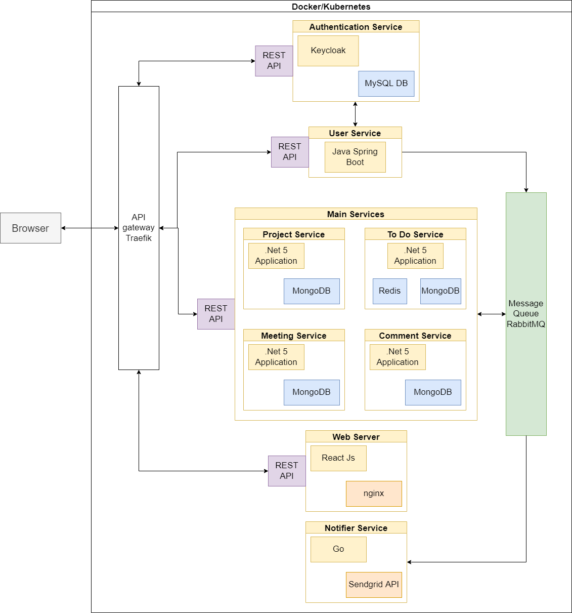
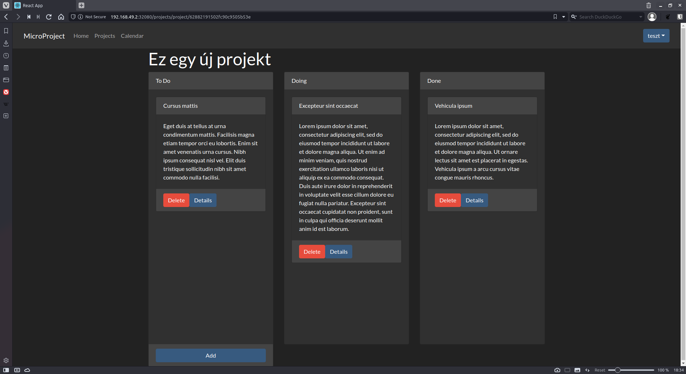

# MicroProject projektkezelő alkalmazás
**Fürjes-Benke Péter**

## Feladat leírása
A cél egy projektkezelő alkalmazás készítése volt, mely mikroszoláltatásokból épül fel. Az egyes szolgáltatások Docker konténerben futtathatók, és a funkcionalitásuk csak egy API gateway-en keresztül érhető el a külvilág számára. Mikroszolgáltatás architektúráról lévén szó, az egyes szolgáltatásoknak egymástól függetlenül működőképesnek kell maradniuk. Ennek értelmében a rendszernek ellen kell állnia a tranziens hibáknak.

### Funkcionalitás részletes leírása
A programnak képesnek kell lennie projektek kezelésére, azon belül a feladatok állapotának nyomonkövetésére. A közös munka megkönnyítése érdekében a felhasználók az egyes feladatok alatt kommenteket írhatnak a haladásukról, vagy éppen javaslatokat tehetnek. Ezen felül a program lehetőséget ad találkozók létrehozására, mely bekerül a résztvevők naptárjába. A találkozókon elhangzott fontos információkról összefoglalókat lehet írni, mely a későbbiekben is visszanézhető. Emellett minden az adott projektben résztvevő értesítést kap a projektet érintő változásokról, módosításokról a regisztrációkor megadott e-mail címükre.

## Architektúra terv
<center></center>

Az architektúra tervezése során a ```Domain Driven Design```-t követtem annak érdekében, hogy meghatározzam a szükséges mikroszolgáltatások körét. Ennek megfelelően összesen 5 alapvető szolgáltatásra bontottam fel az alkalmazást, melyek a ```polyglot``` elvet követve különböző programozási nyelven íródnak. A szolgáltatások elérésének biztosításáért a *Traefik API Gateway* felelős. Továbbá ezen keresztül érhető el az alkalmazás felhasználói felülete is. A szolgáltatások közötti üzenetsor alapú aszinkron kommunikációért pedig egy *RabbitMQ* példány felel.

### Authentikációs szolgáltatás
Egy *Spring Boot* keretrendszerben készített szolgáltatás, melynek feladata a felhasználók kezelése. Egy REST-es API-n keresztül biztosítja a regisztrációhoz, a bejelentkezéshez és az azonosításhoz szükséges funkcionalitást. A felhasználók adatai egy *MySQL* adatbázisban kerülnek eltárolásra, melynek elérése egy ```repository``` interfészen keresztül történik, amit a *Spring Data JPA* keretrendszer alapból biztosít. 

### Projekteket kezelő szolgáltatás
A komponens egy *.Net* alapú alkalmazás, mely REST API-n keresztül biztosítja a projektek létrehozását, és azok kezelését. Az adatok struktúrájához igazodva ebben az esetben már egy dokumentum alapú *MongoDB* adatbázisban kerülnek eltárolásra a szükséges információk. Az adatbázis elérése ebben az esetben is a ```Repository``` mintának megfelelően egy burkoló osztállyal történik.

### Feladatokat kezelő szolgáltatás
A projekteken belül feladatokat lehet létrehozni. Ezek létrehozásáért és kezelésért felel ez a szolgáltatás. A funkciókat REST API-n keresztül biztosítja, a projektkezelő alkalmazáshoz hasonlóan. Ez esetben is a ```Repository``` mintát követi a komponens architektúrája, mely egy *.Net 5* alkalmazásban lett implementálva és maguk az adatok pedig egy *MongoDB* adatbázisban tárolódnak.

### Megbeszéléseket kezelő szolgáltatás
Ennek a komponensnek a feladat az egyes projektekhez tartozó megbeszélések létrehozásáért, és azok kezeléséért felelős funkciók biztosítása. A **projekt** szoláltatáshoz hasonlóan ez is egy *.Net* alkalmazás és az adatok *MongoDB*-ben tárolódnak.

### Hozzászólásokat kezelő szolgáltatás
A feladat leírásának megfelelően a felhasználóknak lehetősége van kommenteket írni az egyes feladatokhoz. Az ehhez szükséges funkciók biztosítása a feladata ennek a szolgáltatásnak. Ez a szolgáltatás is egy *.Net 5* alkalmazás, mely *MongoDB*-ben tárolja a hozzászólásokat.

### Értesítő szolgáltatás
Ez a *Go* nyelven írt szolgáltatás felel azért, hogy értesítse a felhasználókat abban az esetben, ha valamelyik projektjükben változás történt. Mivel ehhez mindegyik korábbi szolgáltatással kapcsolatban kell lennie, ezért egy üzenetsor alapú kommunikációt valósít meg a *RabbitMQ* segítségével. A megkapott üzeneteket pedig továbbítja e-mail-ben a felhasználóknak a *SendGrid API* segítségével.

### Webszerver
A webszerver feladata, hogy elérhetővé tegye a React keretrendszerben megírt weboldalt, mely - felhasználva a korábbi szolgáltatásokat - biztosítja a teljes rendszer funkcionalitását. Ez a szolgáltatás egy *NGINX* webszervert használ.

## API gateway
A MicroProject alkalmazás több szolgáltatásból épül fel, és ezek mindegyike egy meghatározott REST interfészen keresztül publikálja a szolgáltatásait. Annak érdekében, hogy egy címen keresztül el lehessen érni az összes szolgáltatást egy API gatewayt használtam, azon belül is a *Traefik* megoldását, mely egyszerűen konfigurálható a  *Docker Compose* konfigurációs fájljával együtt. A ```docker-compose.yml``` fájlban elég csak megadni a route-olási szabályokat az egyes szolgáltatásokhoz, amik alapján a *Traefik* pedig konfigurálja az elérési utakat. Ezek után már a frontend fejlesztésénél elég volt a *Traefik* által publikált címet, mint alap URL-t használni, és a kérések a megfelelő mikroszolgáltatáshoz irányítódnak.

Az egységes interfészen kívül még előnye az API Gateway használatának, hogy biztonságos *HTTPS* kapcsolatot elég csak kifelé biztosítani, a mögötte lévő szolgáltatások egyszerű *HTTP* protokollon kommunikálhatnak egymással. Továbbá a Traefik egyéb szolgáltatásokat is nyújt, mint például a ```Forward Authentication```, amelyről a következő fejezetben lesz szó.

## Felhasználó authentikáció

Annak érdekében, hogy a szoftver rendelkezzen authentikációval, továbbá authorizációval, elkészítettem a felhasználókat kezelő mikroszolgáltatást. A rendszer ezt a szolgáltatást a ```Federated Identity``` minta szerint, mint authorizációs szerver használja. Ezt úgy értem el, hogy beállítottam a **felhasználó** szolgáltatást ```Forward Auth Middleware```-ként a védeni kívánt végpontokhoz. Így a *Traefik* minden kérés előtt lekérdezi a **felhasználó** szolgáltatástól, hogy az adott felhasználó rendelkezik-e engedéllyel a többi szolgáltatás eléréséhez. Az engedély ebben az esetben azt jelenti, hogy a felhasználó redelkezik-e érvényes ```Json Web Token```-nel. Ha igen, akkor a *Traefik* továbbítja a kérést a megfelelő szolgáltatásnak, egyéb esetben pedig a felhasználót értesíti a hiba okáról.

Hiba esetén a felhasználónak be kell jelentkeznie, vagy ha még nincs fiókja, akkor regisztrálni kell. Ha helyesen adta meg a hitelesítő adatait, akkor a **felhasználó** szolgáltatás generál egy új ```JWT``` tokent, melyben eltárolja az adott felhasználó azonosítóját és a token lejárati idejét, majd aláírja. Mivel minden genenerált token rendelkezik egy aláírással, amihez a titkot csak a **felhasználó** szolgáltatás ismeri, így biztosított, hogy a támadók kellően nehezen tudnak olyan tokent generálni, amit a szolgáltatás érvényesnek ítélne.

### Oauth
A *Spring Secuity* keretrendszer lehetőséget nyújt arra, hogy a sztenderd OAuth authorizációt használjuk. Ez esetben a folyamat annyiban módosulna, hogy nem kellene külön lépésben bejelentkezni, hanem hiba esetén a **felhasználó** szolgáltatás átirányítana egy bejelentkeztető oldalra, amit a *Spring* keretrendszer alapból legenerál. Sikeres bejelentkezés esetén pedig a Traefik hozzáférést adna a többi szolgáltatáshoz. Ezt a megoldást nem sikerült egyelőre implementálnom, viszont a szükséges konfigurációs osztályokat létrehoztam már a **felhasználó** szolgáltatásban.

## Projektek kezelése
Ahogy az architektúra tervnél már ismertettem, a projektek kezelését 4 mikroszolgáltatásra osztottam. Ezek a domain szerint a következők:
- projekt
- feladat
- hozzászólás
- megbeszélés.

A **projekt** szolgáltatás felel a legfelsőbb szintű projekt objektumokért. Ezek tartalmazzák az adott projekt címét, létrehozóját és a tagokat, akik az adott projektben dolgoznak. A projekt szolgáltatásban implementáltam bizonyos fokú jogosultságkezelést. Vagyis egy projektet csak a projektgazda módosíthat, a tagoknak nincs ehhez joguk. A projekteken belül tetszőleges mennyiségű feladat hozható létre, mely kezeléséért felel a **feladat** szolgáltatás. Feladatot bármelyik tag felvehet egy projektben, ez nincs korlátozva. A feladatokhoz hozzá lehet rendelni felhasználókat, akiknek azt el kell végezni. Ezen felül lehet módosítani a feladat állapotát, annak érdekében, hogy nyomon lehessen követni a projekt előrehaladását. A felhasználóknak lehetősége van hozzászólásokat írni az egyes feladatokhoz, ezzel is könnyítve a közös munkát. Mivel domain szinten ez a funkcionalitás is független a többitől, ezért kiszerveztem a megjegyzések kezelését a **hozzászólás** szolgáltatásba. Gondolván arra, hogy egy projekt során több konzultációra is szükség lehet a résztvevők között, ezért ennek kezelésére létrehoztam a **megbeszélés** szolgáltatást. A felhasználóknak lehetőségük van felvenni a megbeszéléseket, mint eseményeket, aminek van egy kezdő időpontja, továbbá azt is meg lehet határozni, hogy előreláthatólag meddig fog tartani. Továbbá lehetőség van arra is, hogy jegyzeteket rendeljenek az egyes megbeszélésekhez, így az elhangzott fontos információk később is elérhetők központilag a rendszerben.

### Adatok tárolása
Mind a 4 szolgáltatás esetében a MongoDB adatbázis mellett döntöttem az adatok tárolását illetően. Ennek főbb oka a NoSQL adatbázisok által nyújtott kiváló teljesítmény és skálázási potenciál, szemben a hagyományos SQL adatbázisokkal szemben, amit például a **felhasználó** szolgáltatásnál használtam. Abban az esetben, figyelembe véve a tárolandó adatokat, nem okoz teljesítménybeli problémát az adatszerkezet relációs reprezentációja.

Egy kisebb hátránya a NoSQL adatbázisoknak, hogy objektumorientált nyelvekben nincs olyan kifejlett támogatásuk, például nem áll hozzájuk rendelkezésre ```ORM```. A NoSQL adatbázis készítőjének kezelőjét(driverjét) kell hozzá használni. Annak érdekében, hogy ```Repository``` mintát alkalmazni tudjam, készítettem el a ```MongoDAL``` modult, ami tartalmazza az ehhez szükséges osztályokat és konfigurációkat. Ez a modul mind a 4 szolgáltatásnak függősége, ezt használják az adatbázissal való kommunikációhoz. A könnyebb bővíthetőséget szem előtt tartva ezt a modult egyrészt generikusként írtam meg, másrészt definiáltam egy interfészt minden szolgáltatásban, amelyek kiegészítésével újabb adatbázis műveleteket lehet hozzáadni a szolgáltatások ```Data Access Layer```-jéhez.

### Fejlesztés alatt
Megvizsgálva a kapcsolatot a projekteket kezelő szolgáltatások között, látható, hogy bizonyos szintű kommunikációra szükség lenne közöttük a konzinsztencia megőrzése érdekében. Persze fontos tisztázni, hogy a mikroszolgáltatás architektúránál, mivel bármelyik szolgáltatás kieshet, ezért csak esetleges konzisztencia valósítható meg. Jelenleg nincs kommunikáció az egyes szolgáltatások között, de a jövőben tervezem ennek a megvalósítását. Ezzel kapcsolatban 2 esetet választanék szét. Az egyik eset, amikor valamilyen objektumot létrehozunk, vagy módosítunk, akkor azonnal ellenőrizni kellene, hogy a többi szolgáltatás szerint is hiteles információkat tartalmaz. Ehhez, mivel mind a 4 szolgáltatás *.Net* alapú, a *Polly* programkönyvtár használatát tervezem, mellyel a tranziens hibákat is kezelni tudnám. A másik eset, amikor töröljük valamelyik objektumot, akkor a többi szolgáltatást is informálni kellene erről, hogy módosíthassák a saját adatbázisukat ennek megfelelően. Mivel ezt aszinkron módon is meg lehet oldani, ezért a terveim szerint az ilyen jellegű kommunikációhoz a *RabbitMQ*-t fogom használni.

## Értesítő szolgáltatás
A projekttel kapcsolatos értesítések küldéséért felelős szolgáltatást nem sikerült elkészítenem, viszont a működését már megterveztem. Ahogy az architektúra tervnél már említettem ez egy *Go* nyelven írt program lesz, mely 2 funkcióval fog rendelkezni. Az egyik, hogy fogadja az üzeneteket a többi projektkezelő szolgáltatástól, a másik, hogy ezeket az üzeneteket továbbítja e-mailben a felhasználók felé. Ennek következtében ez a szolgáltatás nem biztosít REST-es végpontot. Az üzenetek fogadása aszinkron módon történne, vagyis a többi szolgáltatás nem várja meg, míg kap visszacsatolást az e-mail küldés sikerességéről. Ezt a kommunikációt a *RabbitMQ* megoldásával fogom megvalósítani. Annak érdekében, hogy ne kelljen külön *SMTP* szervert használnom, a *SendGrid* e-mail küldő szolgáltatását fogom igénybe venni az e-mailek küldésére. 

Kísérleti jelleggel elkészítettem már a program vázát. Sikeresen megoldottam, hogy egy új feladat létrehozásakor a **feladat** szolgáltatás üzenetet küldjön, amit az **értesítő** szolgáltatás meg is kapott. Viszont több probléma miatt is nem került be a jelenlegi megoldásba. Az egyik, hogy a *RabbitMQ* *Go* nyelvhez készített kliens könyvtára nem megfelelő a mikroszolgáltatás architektúrához, ugyanis nem képes a RabbitMQ szolgáltatás kiesésének helyes kezelésére, például az újracsatlakozás nem megoldott. A másik probléma, hogy még nincs kommunikáció a többi szolgáltatás között, viszont az e-maileket csak a **felhasználó** szolgáltatás ismeri. Ezen információ hiányában pedig nem képes értesítések küldésére. Előbbi probléma megoldásához találtam a [go-rabbitmq](https://github.com/wagslane/go-rabbitmq) programkönyvtárat, ami az alap *RabbitMQ* klienst egészíti ki a szükséges funkciókkal. A végső megoldásban pedig ezt tervezem majd használni.

## React Frontend
A mikroszolgáltatások összefogása érdekében készítettem egy webes felhasználói felületet, melynek feladata, hogy egy egységes felületet biztosítson a projektek kezeléséhez. A felhasználói felületet ```Single Page Application```-ként készítettem el a *React* keretrendszer segítségével. Ennek megfelelően az egyes funkcionalitásokhoz tartozó felületet komponensként hoztam létre, és nem egy teljesen új oldalként.

### Felhasználói felület
A UI tervezése során arra törekedtem, hogy egy letisztult, modern felültet biztosítson a rendszer, melynek használata kényelmes a felhasználók számára. Ennek érdekében merítettem ötleteket több már piacon lévő projektmenedzser alkalmazásból, mint például a *Trello* vagy a *Jira*. Így amellett döntöttem, hogy a projekteken belüli feladatok állapotának vizualizálásához egy kanban táblát fogok használni.

A tábla elkészítése mellett megoldottam, hogy az egyes elemeket *Drag&Drop* módon át lehessen rakni egyik oszlopból a másikba. Annyi megkötés van jelenleg a táblára vonatkozóan, hogy nem lehet más oszlopokat felvenni, hanem a feladatokat fixen 3 csoportba lehet sorolni. Vagyis vannak az elvégzendő, a folyamatban lévő és a befejezett feladatok.

A felhasználóknak természetesen lehetőségük van böngészni a projektjeik között, ehhez nyújt segítséget a projekteket listázó komponens.

Ezen a felületen van lehetősége a projektgazdáknak szerkeszteni az egyes projekteket. Módosíthatják a projektek nevét, és hozzárendelt felhasználók listáját. Továbbá törölhetik is a projekteket, ha arra már nincs szükség. Természetesen ez csak a projektgazdákra igaz, a többi felhasználónak ehhez nincs jogosultsága.

### Adatok lekérdezése
Önmagában a UI mit sem érne az egyes mikroszolgáltatások által nyújtott funkcionalitás nélkül. Ezek eléséréshez a *Flux* mintát használtam, mely az egyirányú adatáramlásra megvalósítására biztosít egy megoldást. Három fontos komponensből épül fel:
- action
- dispatcher
- store.

<center></center>

Az **action** komponens feladata, hogy kezelje a *React* komponensekben bekövetkező eseményeket. Én a projektben több **action** komponenst is létrehoztam, melyeket az egyes szolgáltatások alapján neveztem el. Ebből következik, hogy ezek feladata az adatok lekérése az egyes szolgáltatásoktól, továbbá a módosító események továbbítása. A backenddel való kommunikációhoz az *Axios* csomagot használtam, mely lehetővé teszi az aszinkron kérések küldését a *Javascript Promise API*-ja segítségével. A lekérés eredményét ennek megfelelően egy *Promise* objektum tartalmazza, mely az ```Active Object``` mintát valósítja meg. Ez a komponens felel a kérés eredményének átalakításáért és továbbításáért a **dispatcher** segítségével. Annak érdekében, hogy a **store** komponensek el tudják dönteni, hogy milyen **action** eredményét kapták meg, **action** konstansokat hoztam létre, és ezeket hozzáadom a **dispatcher** felé továbbított adathoz.

A **dispatcher** komponens az egyetlen, melyet a projektben használt *Flux* csomag biztosít. Ennek feladata lényegében az, hogy az **action** komponenstől kapott adattal meghívja az összes regisztrált callback függvényt. Vagyis, ahogy a neve is mutatja, biztosítja az összeköttetést  az **action** és a **store** komponensek között. Ebből a komponensből mindig csak egy példány létezik, tehát ez egy ```singleton```.

A megjelenítés szempontjából a legfontosabb komponens a **store**. Az egyes *React* komponensek ebből nyerik ki a megjelenítendő adatokat. Lényegében ez egy *EventEmitter*, ami a **dispatcher**-nél regisztrál egy callback függvényt. Ebben a belső állapotának módosítása után jelzi, hogy változás történt, amit a regisztrált *React* komponensek érzékelnek, és frissítik az állapotukat. Lényegében a **store** egy központi állapotot reprezentál az alkalmazáson belül. A **store** komponensek számát illetően több megközelítés is létezik, lehet ezt is ```singleton```-ként használni, de lehet domainenként külön **store**-t létrehozni. Én az utóbbi mellett döntöttem, mivel így jobban el vannak szeparálva egymástól az egyes szolgáltatásoktól érkező adatok, továbbá a *React* komponenseknek is elég csak a számukra lényeges **store** változására reagálniuk.

### Authentikáció
Korábbi fejezetben ismertetett authentikációs folyamatot meg kellett valósítanom a frontenden is. Ezt úgy oldattam meg, hogy a felhasználói felületen csak a **welcome** komponens érhető el bejelentkezés nélkül. Ha a felhasználó valamelyik másik komponensre szeretne váltani, akkor automatikusan át lesz irányítva a bejelentkeztető komponensre. Ha a bejelentkezés sikeres, akkor a **user action** komponens eltárolja a kapott *JWT* tokent a *Local Storge*-ban. Egy másik megközelítés az is lehetne, hogy a *Session Storage*-ban tárolom a tokent, viszont ebben az esetben a böngésző bezárása után újra be kell jelentkeznie. Tehát az általam választott megoldással csökkenteni tudtam a szükséges bejelentkezések számát, a token egészen a benne foglalt lejárati dátumig használható. Azt, hogy a bejelentkezés megtörtént-e, a komponens betöltésekor vizsgálom meg úgy, hogy ellenőrzöm a token meglétét a *Local Storage*-ban. 

### Komponensek közötti váltás
Mivel a frontend egy ```SPA```, ezért az oldalak közötti váltást nem a teljes oldal betöltésével történik, hanem csak a megjelenített komponens kerül kicserélésre. Ehhez a *React* keretrendszer biztosít megoldást, aminek a neve *React Router*. Ez lényegében úgy működik, hogy az URL útvonal komponense alapján határozza meg az alkalmazás, hogy melyik komponenst kellene betölteni. Az útvonalaknál igyekeztem beszédes neveket adni, példaként a regisztrációs felület a **/register**, a projektek listája pedig a **/projects** útvonalon érhető el. Abban az esetben, hogyha valamelyik specifikus projekthez tartozó információkat kell betölteni az oldalnak, akkor az útvonal komponens tartalmazza az adott objektum azonosítóját. Tehát például az 1-es azonosítóval rendelkező projekt részletei a **/projects/project/1** útvonalon érhetők el. Egy másik megoldást is vizsgáltam ezzel kapcsolatban. Ami úgy működött volna, hogy egy külön **store** komponensben eltárolom, hogy melyik projektet szeretnénk aktuálisan megnyitni. Viszont ez nem volt jó megoldás, akkor amikor az oldal újratöltődött, mert ilyenkor elveszett ez az információ. Ezért döntöttem végül amellett, hogy magában a path-ban adom meg a projekt azonosítóját, így újratöltéskor is be tudja tölteni az alkalmazás a megfelelő információkat.

Egy érdekes feladat volt még annak a megoldása, hogy amikor a felhasználó nincs bejelentkezve, és például a projekt listát betöltő komponenst szeretné elérni, akkor átirányításra kerül a bejelentkeztető oldalra. Viszont ilyenkor célszerű lenne bejelentkezés után egyből a kívánt oldalra irányítani. Ehhez végül pont azt a korábban említett megoldást választottam, hogy a **user store**-ban tárolom el a kiinduló oldal címét. Így a sikeres bejelentkezés után vissza tudom irányítani a felhasználót a megfelelő oldalra. Itt is problémát jelenthet az, hogy az újratöltéskor ez az információ elvész, viszont ennek az esetnek a kezelését nem tartottam annyira lényegesnek. 

### Fejlesztés alatt
Jelenleg még nincs kész, de a felület rendelkezni fog egy naptár nézettel, ahol a megbeszélések idejéről lehet majd tájékoztatást kapni. Ezen felül itt lehet majd felvenni új megbeszéléseket, mint eseményeket. A megbeszélésre kattintva pedig lehetősége lesz a felhasználóknak leírni, hogy pontosan milyen fontos információ hangzott el a megbeszélésen.

Emellett a kanban felületen lehetőség lesz nem csak a feladatok állapotán módosítani, hanem rákattintva egyéb opciók is elérhetők lesznek. Ilyen a feladat címének és leírásának, vagy a feladatért felelős személyek listájának módosítása. Ezen kívül itt lesz elérhető az hozzászólás folyam, ahol a tagok leírhatják haladásukat, és beszélhetnek az esetleges akadályozó tényezőkről.

Továbbá lesz egy profil oldal is, ahol az aktuális névről, a megadott e-mail címről és egyéb adatokról lehet majd informálódni. Természetesen ezek módosítására is lesz lehetőség, kiemelt figyelemmel az e-mail címekre, hiszen ezen keresztül kaphatnak majd tájékoztatást a fontos projektbeli változásokról.

## Konténerizáció
A fejlesztés során fontos szempont volt, hogy az egyes szolgáltatások telepítése könnyen, gyorsan megvalósulhasson. Ennek érdekében mindegyik szolgáltatáshoz biztosítottam annak lehetőségét, hogy *Docker* konténerben futtatható legyen. Ez egy olyan virtualizációs megoldás, mely kompakt módon, a host operációs rendszer kernelét használva biztosít egy korlátozott funkcionalitással rendelkező Linux operációs rendszert. Így garantálni tudjuk, hogy a szoftverünk mindig a megfelelő környezetben fusson. (Manapság már lehetőség van Windows alapú Docker konténereket is futtatni, viszont ezek csak Windows operációs rendszeren használhatók a korábban említett kernel függőség miatt.)
 
Első lépésként készítettem *Dockerfile*-t minden egyes komponenshez, melyek *Docker image* elkészítéshez használhatók. Ezen fájlok írásánál a többlépcsős build-elést preferáltam, annak érdekében, hogy a végső képfájlok a lehető legkompaktabbak legyen. Ez annyit tesz, hogy külön konténerben fordítom le az egyes szoftvereket és a végső képfájlba csak a ténylegesen szükséges fájlok kerülnek bele.

A *Dockerfile*-ok elkészítésével már elértem, hogy a szolgáltatások egyenként futtahatók legyenek. Annak érdekében, hogy a teljes rendszer felállítható legyen annak minden függőségével együtt, a *Docker Compose* eszközt használtam. A szükséges szolgáltatásokat specifikáltam egy *YAML* fájlban, amit a *Docker Compose* konfigurációs fájlként használ. Ezek után az egész rendszer felállítható pár parancs segítségével.

### Szolgáltatások konfigurálása
Az egyes komponensek tervezésekor külön figyelmet fordítottam arra, hogy a lehető legtöbb paraméter konfigurációs fájlból módosítható legyen. Például lehetőség van szolgáltatásoknál beállítani az adatbázis URL-t, az adatbázis használatához szükséges hitelesítő adatokat, vagy éppen az adatbázis nevét. Ezen kívül a ```JWT``` generáláshoz szükséges titkos bájtsorozat is konfigurálható. Ezeket a paramétereket mind úgy terveztem, hogy ne csak egy konfigurációs fájlból lehessen őket beállítani, hanem környezeti változókkal is. Ezt a megoldást alkalmaztam a ```docker-compose.yml``` fájlban is, mely tartalmazza az összes konfigurálható paramétert, amiket a MicroProject alkalmazás komponensei biztosítanak. Ezen kívül az ismétlődő értékek másolgatásának elkerülése végett létrehoztam egy ```.env``` fájlt is. Az ebben definiált környezeti változók értékei felhasználhatók a ```docker-compose.yml``` fájlban. 

## Összegzés
A MicroProject projektmenedzser alkalmazás fejlesztése során a mikroszolgáltatás architektúrával ismerkedtem meg. Első lépésként megterveztem, hogy milyen szolgáltatásokra lesz szükség a funkcionalitás biztosítása érdekében. Ehhez a ```Domain Driven Design``` megközelítést követtem. A tervek alapján sikeresen elkészítettem az alkalmazás **projekt**, **feladat**, **hozzászólás** és **találkozó** szolgáltatásait. A **projekt** és a **feladat** szolgáltatások bizonyos funkcióit elérhetővé tettem egy *React* alkalmazás formájában, melynek kibővítésével az összes szolgáltatás elérhető lesz a jövőben. 

Az **authentikációs** szolgáltatás elkészítésével megoldottam, hogy ne férjen hozzá bárki a projektekkel kapcsolatos adatokhoz. Ehhez segítségemre volt a *Traefik* API Gateway megoldása, mely amellett, hogy egy egységes interfészt biztosított az egyes szolgáltatások eléréséhez, lehetőséget adott arra, hogy egy authentikációs middleware-t adjak hozzá a védeni kívánt végpontokhoz.

A szolgáltatások könnyebb telepítése érdekében pedig megoldottam, hogy az egész alkalmazás *Docker* konténerekben futhasson. Az egyes szolgáltatások felindításához pedig a *Docker Compose* eszközt használtam, mely megkönnyítette a konténerek paraméterezését, kiváltképpen a *Traefik* használatát.